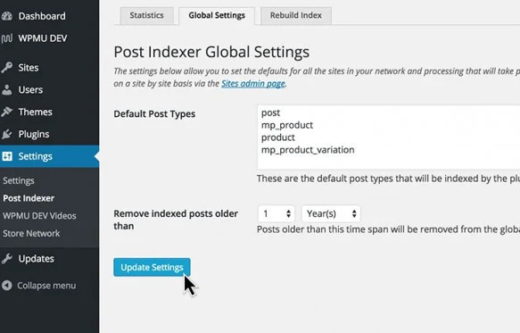
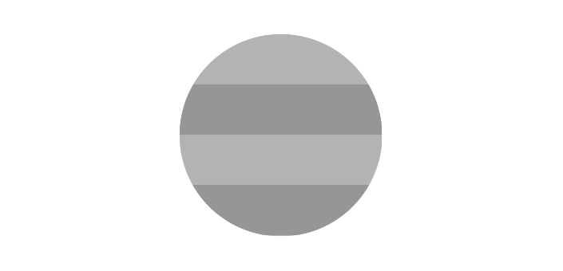
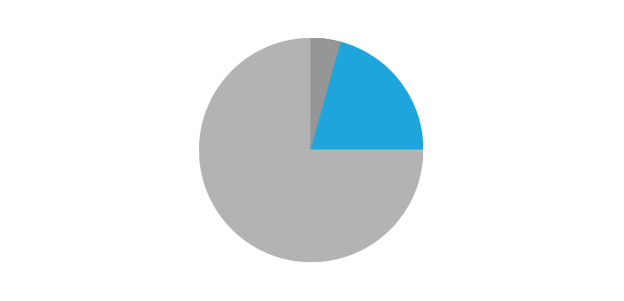
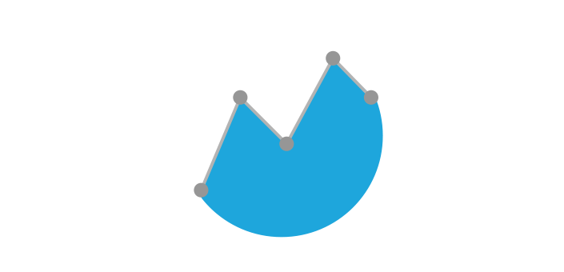

<link rel="stylesheet" href="assets/style.css">

<h2 align="center" style="color:#38c2bb;">📚 Inhaltsverzeichnis</h2>

 
  <a href="https://github.com/cp-psource/ps-postindexer/discussions" style="color:#38c2bb;">💬 Forum</a> 
  <a href="https://github.com/cp-psource/ps-postindexer/releases" style="color:#38c2bb;">📝 Download</a>
  <a href="erweiterungen.html" style="color:#38c2bb;">📖 ERWEITERUNGEN</a>

## Multisite Beitragsindex für Multisite ermöglicht netzwerkweites Suchen und Teilen. Erschließe neue Möglichkeiten zum Suchen und Anzeigen von Inhalten, indem Du Beiträge von beliebigen Webseiten in Deinem Netzwerk in einem Index zusammenfasst.

 Erstelle einen globalen Index für Dein Netzwerk, der nur die Inhalte abruft, die Du hinzufügen möchtest.

### Erweitere die Möglichkeiten von Multisite

Wir haben den Multisite Beitragsindex so entwickelt, dass er mit anderen Plugins zusammenarbeitet, die seine Leistungsfähigkeit nutzen können. Multisite ist zwar ein leistungsstarkes Tool, eine seiner größten Einschränkungen ist jedoch die fehlende Möglichkeit, Inhalte von Webseite zu Webseite in Deinem Netzwerk zu suchen und anzuzeigen.

Wir haben eine große Sammlung von Plugins entwickelt, die dies ermöglichen. Diese Plugins benötigen jedoch einen einzigen Index von Beiträgen, aus dem sie Inhalte abrufen können. Hier kommt der Multisite Beitragsindex ins Spiel. Der Multisite Beitragsindex kann mehr als nur einen Index erstellen. Du kannst bestimmte Unterseiten von der Indexierung ausschließen, eine bestimmte Webseite sofort indexieren, Seiten sowie Beiträge indexieren, Beiträge manuell indexieren, einen Zeitraum für die Indexierung von Beiträgen festlegen und die zu indexierenden Beitragstypen pro Webseite auswählen.

### Alle Statistiken, die Du jemals brauchst

Stelle sicher, dass alles auf einen Blick Deinen Wünschen entspricht.

### Zusammenfassung des Multisite-Beitragsindex

Hier findest Du eine kurze Listenansicht der indexierten Beitragstypen und der meisten indexierten Webseiten.

### Indexierte Beitragstypen

Ein übersichtliches Kreisdiagramm zeigt den Prozentsatz der indexierten Beitragstypen.

### Kürzlich indexierte Beiträge

Zugriff auf kürzlich indexierte Beiträge mit nur einem Klick. Webseiten und Beitragsname werden angezeigt.

### Meistindizierte Websites

Sehe auf einem Blick welche Webseiten am aktivsten sind und wie Beitragstypen in Deinem Netzwerk verwendet werden.

## Multisite neu entdecken

Wir haben eine leistungsstarke Sammlung von Plugins entwickelt, die mit dem Multisite-Beitragsindex zusammenarbeiten und die Funktionen von Multisite erweitern.

*   [**Multsite Reader**](https://cp-psource.github.io/msreader/) – Verwandel Deine Multisite in eine Community, komplett mit „Folgen“-Funktionen im Tumblr-, WordPress.com- und Edublogs-Stil
*   [**Blogs Directory**](https://cp-psource.github.io/blogs-directory/) – Ein vollständig durchsuchbares, Avatar-inklusives, automatisches und recht gut aussehendes Verzeichnis aller Webseiten in Deinem Netzwerk
*   [**Global Site Search**](https://premium.wpmudev.org/project/global-site-search/) – Activate global search across all of the sites on your network with ease
*   [**Global Site Tags**](https://premium.wpmudev.org/project/global-site-tags/) – Display global site tags for your entire network
*   [**Tag feed**](https://premium.wpmudev.org/project/tag-feed/) – Display a list of posts that have been tagged with a specific tag or category
*   [**Recent Global Posts**](https://cp-psource.github.io/recent-global-posts-widget/) – Display a list of recent posts anywhere on your site using a simple shortcode or template function
*   [**Recent Global Posts Feed**](https://premium.wpmudev.org/project/recent-global-posts-feed/) – Create an RSS feed of all the latest posts on your network
*   [**Live Stream**](https://premium.wpmudev.org/project/live-stream-widget/) – Display your own slick animated Live Stream Widget
*   [**User Reports**](https://premium.wpmudev.org/project/user-reports/) – Track user posts across your network

### Expand Global Comments

Pair Multisite Beitragsindex with our [Comment Indexer](https://premium.wpmudev.org/project/comment-indexer/) plugin and expand your global index to include comments from across your network.

*   [**Global Author Comments Feed**](https://premium.wpmudev.org/project/recent-global-author-comments-feed/) – Display a global feed of comments from a single author made across multiple sites on the network
*   [**Recent Global Comments Widget**](https://premium.wpmudev.org/project/recent-global-comments-widget/) – Display the latest comments from across your entire network

*   [**Recent Global Comments Feed**](https://premium.wpmudev.org/project/recent-global-comments-feed/) – Provide a RSS feed of the latest comments on your network
*   [**Live Stream**](https://premium.wpmudev.org/project/live-stream-widget/) – Display your own slick animated live stream of comments
*   [**User Reports**](https://premium.wpmudev.org/project/user-reports/) – Track user comments across your network

 

### A Favorite with Multisite Developers

Multisite Beitragsindex is ready to power your next global post plugin. Add a new global post table behind the scenes in tandem with other plugins and display post content from every site on your network.

 Multisite Beitragsindex provides robust statistics that help keep your network running at optimum performance.

   

 Rebuild your index and include specific custom post types.

### Unharness the Power

Create global post feeds, make all the content across your network fully searchable, use global tags – Multisite Beitragsindex eliminates limitations created by individual site tables. Plus, it works with custom post types so you can add everything from network-wide reading to a global shopping cart for your eCommerce network.

### Complete Diagnostic Tools

The Processor Information module that comes packaged with Multisite Beitragsindex will ensure indexing on your site runs at 100% and will let you know if the plugin runs into any problems pulling content from your subsites. We’ve included everything you need to make sure posts are synced exactly as they should be.

## Usage

For help with installing plugins please refer to our [Plugin installation guide.](https://wpmudev.com/docs/using-wordpress/installing-wordpress-plugins/)

### To Use:

This plugin by itself does not provide any features to your users. It's simply a backend plugin that can be used to build other features. An example plugin demonstrating how the Multisite Beitragsindex can be used is found [here](https://premium.wpmudev.org/project/recent-global-posts-widget). 1\. Install the Multisite Beitragsindex 2\. Visit **Plugins** in your Network Admin dashboard and **Network Activate** the Multisite Beitragsindex plugin there.  

## The Dashboard

From your Network Admin section,  you can access the Multisite Beitragsindex dashboard by going to **Settings > Multisite Beitragsindex**. You should then land on a dashboard with three tabs at the top that look like this: 

 When you first install the plugin, under the first tab labeled _Statistics_, you will probably not see anything. By default, the Multisite Beitragsindex will only index posts created after installation. However, if you would like to index previously published posts, you can do so by going to the third tab -- _Rebuild Index_. As the instructions in the _Rebuild Index_ section warn, "This may take a considerable amount of time and could impact the performance of your server." If you would like to index only selected sites, or if you would like to prevent certain sites from being indexed, then see the next section.  

## Selecting Individual Sites to Index

If you like, you can choose to manually index only certain sites, and you can also choose to prevent individual sites from being indexed at all. You can do this from the Network Admin area by going to **Sites > All Sites**. You should see a new column added here titled _Indexing_. 

 From here you have a choice to:

*   Disable/Enable indexing
*   Edit the settings
*   Rebuild the index for that site only
*   See statistics for that site only

  Just click on the option you'd like for that individual site/blog. 

  

## Choosing Post Types and Index Lifetime

Finally, in the _Global Settings_ tab, you can choose which post types you'd like to index (Posts, Pages, etc.), as well as how long  you would like the index to go back.

  

## Checking to Make Sure It Works

Once you either add more posts or rebuild the index, you should start to see statistics about which sites have been indexed. Keeping in mind that this plugin is only used in conjunction with others, you might also check out a plugin like the [Recent Global Posts Widget](https://premium.wpmudev.org/project/recent-global-posts-widget). If everything is working as it should, the Recent Global Posts Widget should populate with recent posts from your index. (Keep in mind that these other plugins draw from the index that the Multisite Beitragsindex creates. And so if you have disabled indexing for a site, the posts from that site will not be included when a plugin like the Recent Global Posts Widget goes looking for it.)  

## Troubleshooting Potential Problems

If you run into problems, you may want to check for the following: First, make sure the post is published on a site with privacy set to "Allow search engines to index this site." (Found in the regular admin area -- not the Network Admin area -- under **Settings > Reading**.) Next, there are a few config options at the top of post-indexer.php. Unless you're in a very solid dedicated environment, we recommend leaving them as is. **Check to Make Sure The Tables Installed Correctly:** **

<footer class="psource-footer">
  

    ❤️ Entwickelt mit Liebe von <a href="https://github.com/cp-psource" target="_blank">PSOURCE</a> 
    © 2025 – Alle Rechte vorbehalten
  

</footer>